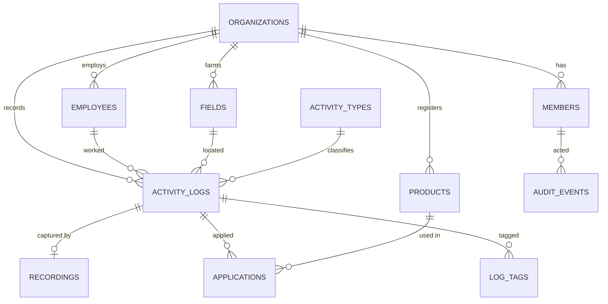

# Defence

What this product is, how it is built, what I added on top of the brief, and why
a real user needs each of those things.

Everything below describes code in this repository. Where something is a plan
rather than a build, it says so.

---

## 1. The product, in one paragraph

Toph sells one promise: a farm worker speaks into a phone at the end of a row,
and months later the farm can answer an inspector. The Figma covers the second
half of that — the place a manager reviews what was captured. This build treats
the Figma as pixel-exact ground truth where it exists, extends it in its own
vocabulary where it does not, and adds the intake half so the loop is real
rather than illustrated.

## 2. Who it is for

Three people touch this product. Only one of them opens this dashboard.

**The field worker** talks into a phone with gloves on, engine running, wind up.
They will not type, and a good half of the people doing crop work in the US
would rather do this in Spanish. Everything they produce is a paragraph of
imperfect speech.

**The compliance manager** is the only user of this screen. They open it at 7am
and have ten minutes before the crew is out. Their loop is: *what happened
yesterday, is anything wrong, are we audit-ready.* They are not reading
transcripts — they are triaging, looking for the three logs that are wrong in a
list of fifty that are fine.

**The inspector** arrives rarely and at short notice, and asks narrow questions:
what went on this field, at what rate, by whom, under what conditions, and when
was it safe to walk back in.

### The reading of the brief that drove everything

The Figma is an **operations** dashboard, not a compliance one — its stat cards
are Today's Recordings, Active Workers, Response Accuracy. Every applicant who
reads "compliance" on toph.farm will build compliance screens. The more useful
reading is that **compliance is downstream of good operational records**: build
the morning triage loop properly and audit-readiness falls out of it. That is
the shape of everything that follows.

The stakes are not invented. California DPR requires a monthly Pesticide Use
Report; restricted-entry and pre-harvest intervals decide when a human may walk
back into a block; FSMA gives 24 hours to produce records. Penalties run
$700–$15,000. A missing product name is not a data-quality issue — it is the
difference between a filed report and an unfiled one.

---

## 3. Architecture

### Stack and why

| Choice | Why this one |
| --- | --- |
| **Next.js 14, App Router** | Server Components put the database next to the render, so a screen is one round trip instead of a waterfall of client fetches. Server Actions mean mutations are functions, not a REST layer written to serve one UI. |
| **Supabase (Postgres)** | The domain is relational — a spray is a tank mix of products, each with its own interval. RLS gives a tenant boundary the database enforces rather than one every query has to remember. |
| **Tailwind** | The Figma is a pixel spec. Utilities keep the spec and the implementation in the same line of code, so a 14px gap is visibly a 14px gap. |
| **Framer Motion** | Layout animation (`layoutId`) is the part that is genuinely hard to hand-roll; it is used for continuity — travelling highlights, a wash that follows the pointer — not decoration. |

No other runtime dependencies were added. Everything below is built out of these.

### Shape of the repo

```
app/
  (shell)/            route group: the rail + the scrolling column
    layout.tsx        rail lives HERE, not in each page — see §5
    page.tsx          Dashboard
    inbox/            Inbox
    activity-logs/    the full archive
    replay/           the day, scrubbed
    map/ audit-manager/ reports/ employees/ performance/ settings/
  api/
    ingest/           audio in, log out  ← the intake half
    exports/pur/      CA DPR Pesticide Use Report
    exports/logs/ records/  CSV
    search/           command palette backend
  actions/            Server Actions: logs, applications, extraction, tags…
lib/
  ingest/             transcribe → extract → persist
  repositories/       every database read, one module per aggregate
  extraction.ts       the five fields, confidence, compliance checks
  compliance.ts       REI/PHI, governing restriction on a tank mix
  inbox.ts            the one triage model: what is waiting, and what clears it
  anomaly.ts          rates measured against the applicator's own history
  replay.ts           a day as a timeline: presences, closures, incursions
  vocabulary.ts       what the farm's corrections have taught the extractor
  reports.ts palette.ts logQuery.ts auditQuery.ts motion.ts
components/           one directory per screen + shell/ nav/ ui/ charts/
```

### Request lifecycle

1. `app/(shell)/layout.tsx` resolves the viewer once and gates on it. Every page
   below inherits the check, so there is no eleventh page that forgot.
2. The page calls one loader (`lib/loadDashboard.ts`, `lib/loadInbox.ts`) that
   fans out with `Promise.all` and returns a single plain object.
3. Repositories are the only place a table is named. They parse with Zod at the
   boundary, so a schema drift is a caught error rather than an `undefined`
   three components deep.
4. Filters, sort, date range and which rows are open all live in the **URL**.
   That is what makes every view linkable — an inbox item, a selected field, an
   open log are all a query string somebody can send to somebody else.
5. Mutations are Server Actions returning a typed `ActionResult`. The UI applies
   them optimistically and rolls the row back on failure with a toast.

### Data model



Four decisions in it worth defending:

**`applications` is its own table, not columns on a log.** A single spray is
often a tank mix of two or three products, each with its own rate and its own
re-entry interval. Flattening it caps the farm at one product per pass and makes
*"which interval governs?"* unanswerable. `governingRestriction` answers it by
taking the longest.

**`activity_types.requires_product` is a column, not a hardcoded list.** It is
the single fact that turns "a harvest with no product" into *not applicable* and
"a spray with no product" into *a gap*. Putting it in the database means the
compliance rule is farm-configurable instead of a string match in a component.

**`recordings.transcript` stays in the language it was spoken**, with
`transcript_en` alongside. The original is the record an inspector is entitled
to; the translation is a convenience for the reader. Overwriting one with the
other destroys evidence.

**`recordings.extracted_fields` is JSONB carrying `{value, confidence,
corrected, original}` per field.** Confidence has to survive to the screen or
the manager cannot tell what to check; `corrected` has to survive or nobody can
tell a machine's guess from a human's decision; and `original` — what the
machine heard before the fix, written once and never overwritten — is the only
record of the mistake, which is what the farm vocabulary is built from.

---

## 4. What I built on top of the Figma

Each is stated the way I would defend it out loud.

### 4.1 Extracted fields with per-field confidence

Five labelled lines — activity, product, rate, field, conditions — instead of a
paragraph, each carrying its own confidence, with anything under 75% flagged to
listen back.

> *Per-field, not per-recording, because "this log is 94% accurate" gives a
> manager nothing to do, while "the rate came through at 61%" tells them exactly
> which line to play back. Speech recognition degrades precisely where this
> product needs it most: chemical names, numbers, and wind noise.*

`lib/extraction.ts`, `components/dashboard/ExtractedFields.tsx`

### 4.2 Inline correction, from the farm's own lists

Every extracted field is editable in place. The editor is a combobox that
suggests the farm's registered products, real field names and activity types,
and the corrected field is then marked **edited**.

> *Without correction the extracted fields are decoration — the machine gets 95%
> and a record that is 95% right is still an unfiled report. Suggestions come
> from the register because a product has to match it or it has no EPA number:
> typed freehand, "Glyphosate 41%", "glyphosate 41" and "Glyphosate" file as
> three different things and two of them silently fail the compliance check.*

Two details worth pointing at: the compliance checks re-derive the instant the
correction lands, so the badges turn green in front of the user; and a
suggestion is only committed when it has been **deliberately** highlighted —
pressing Enter over a partial match never silently substitutes a different
registered chemical.

`components/dashboard/FieldCombobox.tsx`

### 4.3 One triage surface — the Andon board, as an inbox

Restricted fields first, then compliance gaps, then audio worth a second listen,
then logs simply not yet read. Each row says why it is there and **opens in
place**. The dashboard carries a one-line count of it and a door to it.

> *The manager's question is not "show me my logs", it is "which three are
> wrong". This is the Andon board from a factory floor — pull the exceptions out
> so the 95% that is fine can be ignored.*

This started as two screens and the merge is the decision worth defending. There
was a five-row queue on the dashboard *and* an inbox listing the same items, and
the queue's rows navigated to the dashboard's own table, scrolled a thousand
pixels down to find the row they described. Two surfaces doing one job, the more
prominent one doing it worse, and a third half-copy — a live "Field re-entry"
panel — on the Audit Manager.

> *A list you cannot act on is a menu, not a worklist. If clicking an item takes
> you somewhere else to do the work, the screen was never the work — it was an
> index. So items open where they are, and there is exactly one list.*

`lib/inbox.ts`, `components/inbox/InboxScreen.tsx`,
`components/dashboard/AttentionBanner.tsx`

### 4.4 Field safety — REI and PHI on the map and in the log

Fields under a restricted-entry interval are drawn red on the farm map and
carry a band inside the log itself saying when they clear and after what
product.

> *This is the highest-stakes sentence the dashboard can say, and the only one
> where the cost of missing it is a person rather than a penalty. Re-entry is
> the error growers most often make — they check the pre-harvest interval before
> picking and forget yesterday's spray still has four hours to run — and the
> person who pays is the worker sent in to pick.*

`lib/compliance.ts`, `components/dashboard/FieldSafety.tsx`, `components/map/FarmMap.tsx`

### 4.5 One-click CA DPR export

The Pesticide Use Report in the state's own column format, with a footer
counting what was **excluded** and why.

> *The monthly PUR filing is the single recurring compliance obligation this
> customer actually has, and it is the moment all year when a missing product
> name costs money. The excluded-count footer is the point: an export that
> silently drops incomplete records is worse than no export, because the manager
> files it believing it is complete.*

`app/api/exports/pur/route.ts`

### 4.6 What the inbox opens

An item expands to the three things that clear it: what the worker said, the
extracted fields (correctable), and the compliance record (fileable). Not the
dashboard's full panel — no player, map, tags, edit or delete.

> *An inbox item is a question with a specific answer: the product is missing, or
> the record was never filed, or the audio came through badly. Showing the whole
> log makes the manager find the relevant part of a six-section panel; showing
> the three blocks that answer it means clearing an item is reading a paragraph
> and fixing a field.*

The blocks are the same components the dashboard uses, so a correction made here
re-derives the same checks and writes the same record. Two screens disagreeing
about whether a log is compliant would be worse than either missing a feature.

The design decision I would defend hardest: **there is no private read flag.**
Marking an item read marks the underlying log reviewed. A read flag that does not
change the record is a second truth about a log, and the day it disagrees with
the log's real status is the day the inbox starts lying.

`components/inbox/TriagePanel.tsx`

### 4.7 The intake half (AI)

`POST /api/ingest` takes audio, stores it before attempting anything on it,
transcribes (Whisper or Deepgram by whichever key is present), extracts the
structured fields against the farm's own vocabulary, and writes a log.

> *Without this the dashboard is a viewer for data somebody else produced. With
> it the loop is real: speak, and the log appears with its confidence attached.*

Two deliberate properties: the extractor is instructed to **never guess** a
rate, area or weather value — null is a supported answer, and the dashboard is
built to surface nulls as gaps. And there is a deterministic fallback parser
with no API key at all, because the guided voice log asks fixed questions in a
fixed order, which keeps the demo honest and the pipeline testable.

`lib/ingest/`

---

### 4.8 Farm Day Replay — the only screen that knows time *and* place

`/replay`. The farm's map with a day scrubbed across it: worker dots appearing
at their log's start and leaving at its end, fields turning red when a spray
closes them and green when the interval lifts, and blocks nobody touched staying
grey. Draggable timeline, play/pause, 1x/2x/5x, and the day's findings marked on
the track.

> *A re-entry violation is not in any row. It is two rows — a spray that ended at
> 11:30, somebody else on the same block at 1:00 — plus a number on a product
> label. A table can hold all three facts and still never tell you, because
> seeing it means joining them in your head. This joins them.*

The seeded day says it out loud: Ben Flora sprays Field K with Spinosad at
10:00, four-hour interval; Sonya Alexis logs pest control on Field K at 1:00 —
two hours inside the window. The screen states that in the header before you
press anything, because **a visualisation you have to watch to learn its finding
is a screensaver.** Play is for the demo; the scrubber and the marks are for
the job.

Grey is the third state and the one worth defending: a field with no rows is
invisible in a list and obvious on a map. The absence is the finding.

`lib/replay.ts`, `lib/repositories/replay.ts`, `components/replay/`

### 4.9 Rate anomalies — real, legible, and probably wrong

Each filed rate is compared against the same applicator's own earlier passes with
the same product. Outside 0.5x–1.5x of their average, it goes to the inbox with
its own severity.

> *Every other exception here is an absence — a product nobody named, a record
> nobody filed, audio nobody could make out. This one is present, legible and
> typed by a person, and still probably wrong. Catching it means knowing what
> this applicator normally does, which is knowledge the farm has and no single
> row contains.*

Three decisions in it:

**The baseline uses only earlier passes.** Including the outlier in its own
average drags the mean towards it — six passes with one at four times the rest
flags at 2.4x instead of 4x — and makes the verdict depend on how much history
happens to accumulate afterwards.

**Three passes minimum.** Flagging someone's second-ever application against
their first is noise wearing the costume of an insight.

**It is violet, not amber.** The other severities are drawn in the language of a
fault. Dressing an anomaly as an error teaches the manager to dismiss it at a
glance, and the one time it is a real over-application is the time that habit
costs them. The expanded row shows the comparison, not the verdict: 2 gal/acre,
their average 0.5 over five passes, 4x — so the likeliest outcome, a manager who
knows why, takes one read.

`lib/anomaly.ts`

### 4.10 Farm vocabulary — the flywheel

Settings lists what the farm has taught the extractor: *Spinosad 480SC — learned
from 3 corrections — "spin assault", "spinosa", "Spinos ad"*. And the ingest
pipeline consults it, so the mistake stops repeating.

> *Every correction is already a labelled example. A farm's vocabulary is small,
> closed and strange — eleven blocks with invented names, products whose labels
> are chemistry rather than English — and no general speech model will ever hear
> "Field K" reliably. The farm already knows the answer; the tenth correction of
> the same mistake is the product failing to learn something it was told nine
> times.*

The lookup is an **exact match** on the string the extractor produced, not
phonetic matching. It is the version that cannot be wrong, and fuzzy matching
would start guessing — the behaviour the whole feature exists to reduce. It
applies to the three closed-list fields only; a rate or a weather note is
somebody's sentence, not a name.

`lib/vocabulary.ts`, `components/settings/VocabularyPanel.tsx`

## 5. Product decisions worth defending

**The rail lives in the route group's layout, not in each page.** When it was
inside every page, changing screens unmounted and rebuilt it — a measured
~1050ms where nothing acknowledged the click. Now only the column beside it
suspends, and the highlight moves on the click rather than on the commit.

**The column scrolls; the rail does not.** The shell is viewport height at `xl`
and `<main>` owns its overflow, so a long table never pushes the *document* into
scrolling and takes the navigation with it.

**Every filter is in the URL.** It is what makes the triage queue, the map and
the Audit Manager able to hand the user to the exact row that is wrong, and what
makes a manager's filtered view something they can send to somebody else.

**Optimistic status changes with per-row rollback.** A manager clearing a
morning's logs is going down a list; a spinner between each one turns thirty
seconds into two minutes. Failures restore the row and say why.

**A period control is labelled "Filter", not "This year".** Naming a control
after its current value makes it read as a statement about the screen rather
than something you can open. The value follows the verb once it is off default.

**Field plots are traced onto real parcels.** The map's rectangles were an
arbitrary grid floating over woods and water. They now sit on the actual blocks
— squared off, on the section roads — and the worker's pin sits inside the
field it belongs to. A map you cannot trust is worse than no map.

**"2 more" was removed from the bar charts.** A bar labelled with a count and
carrying real hours is a number from nowhere. Short tails are now drawn in full;
long ones fold into "Other" and say what is inside.

**Rows open where you are standing.** The Inbox and the Activity Logs archive
both had rows that described a log and an "Open" that navigated to the
*dashboard*, leaving the reader to find the row they had just clicked in a table
a thousand pixels long. Both open in place now, through one shared panel
(`LogBrief`), and so does a worker dot on the replay. A list you cannot open is
an index, not a screen.

**A screen's own defaults have to be writable.** The archive opens on all time
where the dashboard opens on this month, and the URL serialiser omitted any
value equal to the *model's* default — so picking "This Month" there produced a
URL with no range, the page's redirect forced it back to all time, and the chip
snapped back on every click with a full server round trip behind it. That was
the white flash. Screens whose defaults differ now state those keys explicitly.

**One concept, one screen — a deliberate pass to remove duplicates.** "Needs
attention" had grown onto three surfaces with three definitions: a five-row queue
on the dashboard, the inbox, and a live re-entry panel on the Audit Manager,
which also announced "2 records need attention" directly above a panel titled
"Needs attention (2)". Two types (`LogException` and `InboxItem`) encoded the
same ranking, so they could drift. Now: one model, one list, one vocabulary — the
Inbox says *needs attention* about today's exceptions, the Audit Manager says
*incomplete records* about a filing period, and the dashboard reports a count of
the first rather than copying it.

**Nothing wears an affordance it cannot honour.** The weekly chart's columns were
`<button>`s for hover alone — seven pointer cursors per screen promising a click
that did nothing, on a chart with no per-week view to go to. They are labelled,
focusable figures now. The inbox's rows carry a chevron that turns, not an
"expand" glyph that reads as a link elsewhere. And the rail's Dashboard pill was
showing the same number as the inbox badge 150px away; the count now sits only on
the control that acts on it.

**Loading skeletons reserve the true height.** The row knows its activity before
the detail arrives, and the activity decides whether the panel will carry an
"Applied" block — so the skeleton reserves 83px for a spray and not for a
harvest, instead of splitting the difference and jolting the table either way.

---

## 6. What I cut, and why

**A tamper-evident hash chain over the audit log.** Nobody attacks the integrity
of a demo app's event log, and defending cryptographic linking spends the
interview on the least product-relevant thing in the repo. The audit trail is
now a plain change log: who, what, when, which fields moved. Migrations
0021–0022 removed the hashes, the triggers, the verifier and the coverage view.

**Rate limiting.** Real for a public API, theatre for a single-tenant demo
behind auth.

**The `ingest_jobs` queue.** Five tracked states for a synchronous endpoint that
nothing retries and no screen displayed. What matters to a farm manager is the
log at the end.

**Messages, Schedule and Support screens.** They existed to show breadth. Breadth
is not the thing being judged; whether the one user's morning got faster is.

---

## 7. Known limits

- **Multi-tenancy is enforced but single-org in practice.** Every write scopes to
  `org_id` and RLS is on; nothing in the UI switches organisations.
- **Confidence is provider-derived.** Whisper's per-segment logprobs are folded
  into a 0–1 number by a linear mapping. It is directionally right and not
  calibrated.
- **The offline extractor is deterministic, not clever.** It relies on the guided
  voice log's fixed question order. Freeform speech without an API key extracts
  little — correctly returning null rather than guessing.
- **`supabase/seed.sql` has drifted from the live demo data.** The hosted
  database carries the current crew, transcripts, traced plots and audio;
  reseeding from the file would reproduce the earlier set.
- **Timezones are UTC throughout.** A real deployment needs the farm's local
  zone, because "did the re-entry interval clear?" is a local-time question.

## 8. How it was verified

No unit tests — deliberately, for a two-day build. Instead ten Puppeteer
harnesses drive the real app in a real browser and assert on behaviour a user
would notice: that the wash follows the pointer without snapping back, that a
skeleton is the height of what replaces it, that a misspelled chemical still
finds its log, that the correction turns a check green, that the export counts
what it excluded, that the rail never moves while the column scrolls.

The demo harness additionally **restores itself**, and `scripts/reset-demo.mjs`
puts the seeded farm back to its opening state — uncorrected log, unread inbox —
so the walkthrough can be run twice.

Layout was checked at 1920×1080, 1680×1050, 1536×864, 1440×900, 1366×768 and
1280×800: the page never scrolls, the column does, the rail never moves.

## 9. What I would build next

1. **Push the exception, don't wait for the visit.** The restricted-entry
   warning is worth an SMS to the crew lead, not a red block on a screen nobody
   opened. This is the feature with the largest gap between its value and its
   cost.
2. **Calibrate confidence against corrections.** Every inline correction is a
   labelled example of the extractor being wrong. That is a feedback loop the
   product is already collecting and not yet using.
3. **The worker's side.** The phone app is assumed here and stubbed by the
   ingest endpoint. Everything upstream of a good record is upstream of this
   dashboard.
